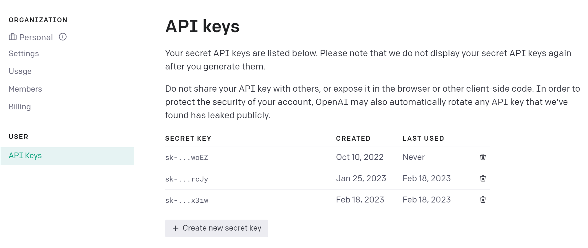
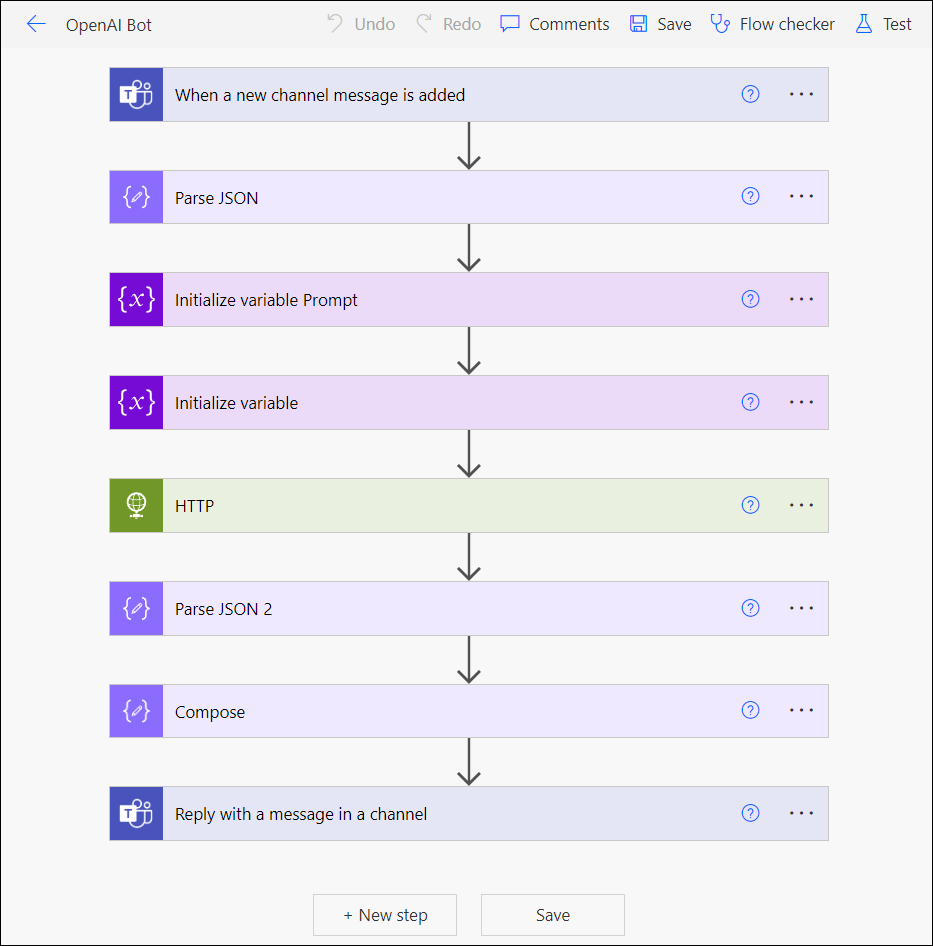
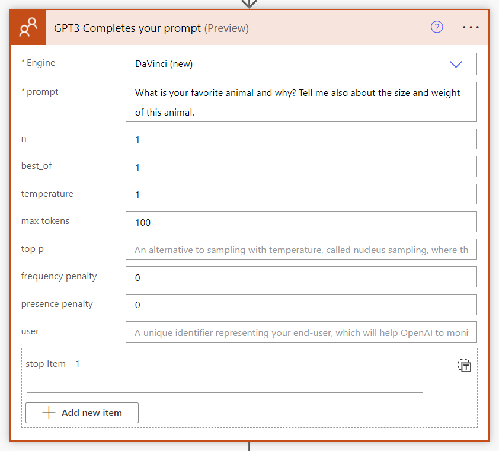
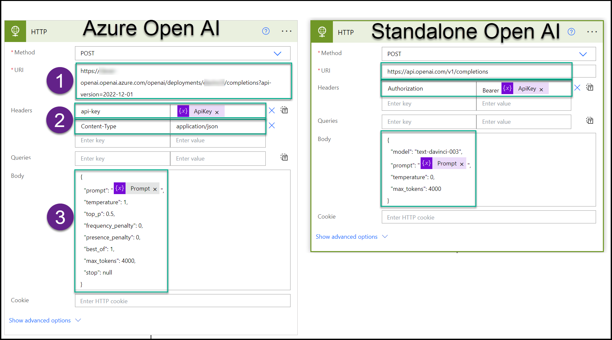

# Power Automate Flows for OpenAI and Azure-based OpenAI

This Github repository contains two Power Automate flows that use OpenAI to answer questions in Teams. One flow uses the Standalone OpenAI service, while the other uses Azure OpenAI.

## Overview

The purpose of these flows is to demonstrate how to integrate OpenAI into a Power Automate flow to answer questions posted in a Teams channel. The flows use the text-davinci-003 model from OpenAI to generate responses.

The HTTP connector is used to send an HTTP request to the OpenAI API, which requires an API key. Unfortunately, the HTTP connector requires a premium license. However, the flows are provided for educational purposes and can be adapted for use with other APIs or connectors.

## Pre-requisites

To use these flows, you will need an API key from OpenAI. You can sign up for a free account at [the OpenAI website](https://openai.com/) and get your API key from the dashboard.

## Flows

Both flows are nearly identical and have the following actions:

### OpenAI Flow

The OpenAI flow ([Get Answer from OpenAI MS Teams.zip](https://github.com/Zerg00s/open-ai-teams-chat-bot/raw/main/Get%20Answer%20from%20OpenAI%20MS%20Teams.zip)) is designed to work with the Standalone OpenAI service. It uses an HTTP action to send a POST request to the OpenAI API, with the prompt variable as the value for the prompt key. The response is then parsed using the JSON schema provided and the answer is posted in the Teams channel using the "Reply with a message in a channel" action.

💡Hint: as [Laurens N](https://www.linkedin.com/in/laurensnijssen) pointed out, the HTTP action and the Parse JSON 2 action can be replaced with a ChatGPT3 connector.

### Azure OpenAI Flow

The Azure OpenAI flow ([GetAnswerfromAzureOpenAI-MSTeams.zip](https://github.com/Zerg00s/open-ai-teams-chat-bot/raw/main/GetAnswerfromAzureOpenAI-MSTeams.zip)) is designed to work with the OpenAI service provided as part of your Azure subscription. It uses an HTTP action to send a POST request to the OpenAI API, with the prompt variable as the value for the prompt key. The API key is added to the Authorization header with the value Bearer. The response is then parsed using the JSON schema provided and the answer is posted in the Teams channel using the "Reply with a message in a channel" action.

## Differences between two flows

There is a difference between the two flows in how the API key is added to the request. The OpenAI flow uses the API key as the value for the Authorization header, while the Azure OpenAI flow uses the API key as the value for the api-key header.

The body of the request is a little different too.

Also, the URL in Azure-based OpenAI service contains a name of your resource as well as the model name.

## Conclusion

These Power Automate flows provide a simple example of how to use OpenAI to answer questions in Teams. By modifying the flows, you can integrate other APIs or connectors to achieve different automation tasks.

If you have any questions or feedback, please feel free to leave a comment in the repository, in the issues section.
